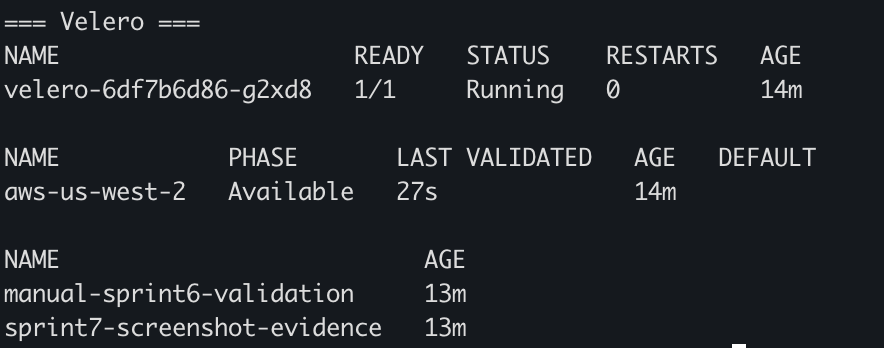
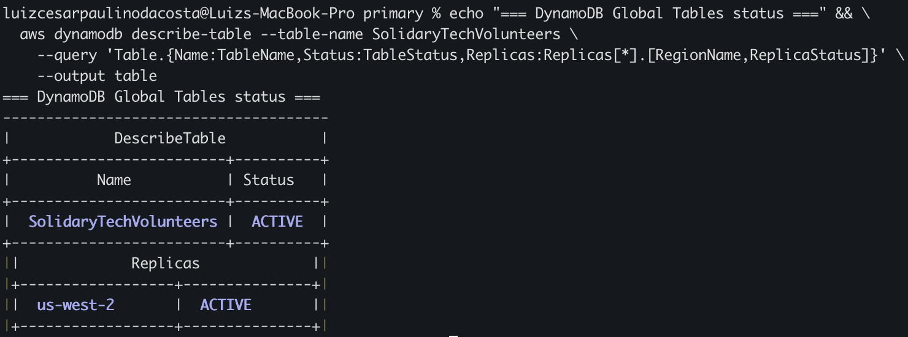

# Disaster Recovery — Estratégia Técnica

> Companion do [PCN.md](PCN.md). Detalha como a estratégia de Warm Standby
> cross-region é implementada na infraestrutura SolidaryTech.

## Decisão arquitetural: Warm Standby

Avaliação de 3 padrões clássicos de DR (Gartner / AWS Well-Architected):

| Padrão | RTO típico | RPO típico | Custo (DR posture) | Adotado? |
|--------|-----------|-----------|-------------------|----------|
| **Backup & Restore** (frio) | horas | horas | ~$0 | ❌ RTO acima do SLO de 15min |
| **Pilot Light** | ~30min | minutos | ~$5/mês | ❌ Próximo, mas exige scale-up de RDS no failover (slow) |
| **Warm Standby** ✅ | ~15min | minutos | ~$18/mês | ✅ **Adotado** |
| **Multi-Site Active/Active** | seg | seg | ~$200+/mês | ❌ Custo proibitivo p/ ONG |

**Por que Warm Standby vence:**
- RDS replica **já provisionada** (sem cold-start no failover)
- DynamoDB Global Tables (replicação nativa, ~segundos)
- EKS node group skeleton (1 node), escala on-demand pra 3
- Custo ~$0.62/dia justificável pelo perfil de risco

---

## Componentes da estratégia

### 1. RDS donation-db: Cross-Region Read Replica

```hcl
# terraform/environments/dr/main.tf
module "databases" {
  source = "../../modules/databases"
  ...
  # Replica do RDS donation-db do primary
  donation_db_replicate_source_db_arn =
    "arn:aws:rds:us-east-1:${var.account_id}:db:solidarytech-donation-db"

  # Não precisa criar ngo-db replica — Velero cobre
  create_ngo_db = false
}
```

**Comportamento:**
- Replicação assíncrona via PostgreSQL streaming replication
- Lag típico: 30s-2min (depende de carga)
- **Read-only** até promoção manual (failover)

**Promoção em failover:**
```bash
aws rds promote-read-replica \
  --db-instance-identifier solidarytech-donation-db-dr \
  --region us-west-2
```

### 2. DynamoDB volunteers: Global Tables

```hcl
# terraform/modules/databases/main.tf
resource "aws_dynamodb_table" "volunteers" {
  ...
  replica {
    region_name = "us-west-2"  # ← Global Tables nativo
  }

  # Pré-requisito (já habilitado desde Sprint 2):
  stream_enabled   = true
  stream_view_type = "NEW_AND_OLD_IMAGES"
}
```

**Comportamento:**
- Replicação **multi-master bidirecional**
- RPO ~segundos (typicamente 1-3s)
- Sem promoção manual — leitura/escrita imediata em qualquer região

### 3. ngo-db (não-crítico): Velero backup

Backup diário das resources Kubernetes + persistent volumes (caso houvesse) para bucket S3 cross-region.

```yaml
# velero schedule (criado via CLI)
schedule: "0 3 * * *"  # 3 AM UTC diário
ttl: "720h"            # retenção 30 dias
includedNamespaces: ["solidarytech", "argocd"]
storageLocation: aws-us-west-2
```

**Restore em DR:**
```bash
velero restore create dr-restore-$(date +%Y%m%d) \
  --from-backup daily-backup-$(date -d yesterday +%Y%m%d)
```

### 4. SQS: Recriação no failover

SQS **não suporta replicação cross-region nativa**. Estratégia:
- Fila recriada via Terraform no DR (`solidary-donations` no us-west-2)
- Mensagens em voo no momento do desastre: **perdidas**
- Mitigação: doação é confirmada ao usuário **antes** do publish na fila (DB insert é a fonte de verdade); SQS é apenas notificação async

**Aceitação:** RPO=0 para a transação de doação (no DB). Para notificações async, RPO=segundos no caso normal, perda total em failover regional.

### 5. ECR: Cross-Region Replication

```hcl
resource "aws_ecr_replication_configuration" "this" {
  replication_configuration {
    rule {
      destination {
        region      = "us-west-2"
        registry_id = var.account_id
      }
      repository_filter {
        filter      = "ngo-service|donation-service|volunteer-service"
        filter_type = "PREFIX_MATCH"
      }
    }
  }
}
```

Imagens disponíveis no DR sem rebuild.

### 6. Manifests K8s: Git

Source of truth dos manifests é `gitops/` no repositório GitHub. ArgoCD reinstalado no DR aponta para o mesmo repo — sincroniza estado idêntico ao primary.

---

## Procedimento de failover (técnico)

Encapsulado em `scripts/dr-failover.sh` (Sprint 6.5).

### Fase 1: Provisionar EKS DR (se em modo "skeleton")

```bash
cd terraform/environments/dr
terraform apply -auto-approve  # ~5min (cluster já existe, só escala)
aws eks update-kubeconfig --name solidarytech-cluster-dr --region us-west-2
```

### Fase 2: Promover RDS replica

```bash
aws rds promote-read-replica \
  --db-instance-identifier solidarytech-donation-db-dr \
  --region us-west-2
# Aguardar status "available" (~3-5min)
aws rds wait db-instance-available \
  --db-instance-identifier solidarytech-donation-db-dr \
  --region us-west-2
```

### Fase 3: Velero restore (ngo-db data + manifests)

```bash
velero restore create dr-restore-$(date +%Y%m%d) \
  --from-backup $(velero backup get -o json | jq -r '.items | sort_by(.metadata.creationTimestamp) | last | .metadata.name')
```

### Fase 4: Atualizar secrets com endpoints DR

```bash
./scripts/generate-secrets.sh --env dr
./scripts/apply-secrets.sh
```

### Fase 5: Aplicar ArgoCD Applications

```bash
kubectl apply -f argocd/applications.yaml
# ArgoCD sincroniza gitops/ → pods sobem
```

### Fase 6: Validar

```bash
kubectl get pods -n solidarytech
# Aguardar 3/3 Running
curl http://$(kubectl get svc -n ingress-nginx ingress-nginx-controller -o jsonpath='{.status.loadBalancer.ingress[0].hostname}')/donations/health
```

### Fase 7: DNS cutover (manual nesta versão)

Atualizar Route53 (futuro) ou comunicar novo endpoint a parceiros.

**Tempo total esperado:** 12-15 minutos

---

## Limitações conhecidas

1. **Mensagens SQS em voo** se perdem em failover regional. Mitigação aplicação: doação confirmada antes do publish.
2. **Latência cross-region** ngo-service ↔ donation-service: se um falhar e outro estiver up, há latência adicional (~70ms us-east ↔ us-west). Apenas notável durante failover parcial (raro).
3. **AWS Academy LabRole** não permite criar IAM roles customizados — Velero precisa de IAM via secret (workaround documentado em `scripts/install-velero.sh`).
4. **Failback** não é totalmente automatizado — exige decisão humana sobre quando us-east está estável o bastante.

---

## Evidências em execução

**Velero — backup cross-region us-west-2 funcionando:**



> Schedule diário `solidarytech-daily` ativo (03:00 UTC, TTL 30 dias) + 2 backups manuais já completados. BackupStorageLocation `aws-us-west-2` em estado Available.

**DynamoDB Global Tables — replica em us-west-2:**



> Replica `SolidaryTechVolunteers` em us-west-2 com status `ACTIVE`. Replicação multi-master nativa (latência típica < 1s).

---

## Drills e validação contínua

| Drill | Objetivo | Comando | Frequência |
|-------|----------|---------|-----------|
| **Velero restore test** | Backup recente é restaurável? | `./scripts/dr-restore-test.sh` | Semanal |
| **DR failover automated** | RTO < 15min? Pods sobem? | `.github/workflows/dr-drill.yaml` | Mensal |
| **Failover real (Game Day)** | E2E com tráfego sintético | Manual, war-room | Trimestral |
| **Failback** | Tempo de cutover reverso | Manual | Anual |

Resultado dos drills → `docs/drills/YYYY-MM-DD-drill-report.md`.

---

## Próximos passos / não cobertos nesta versão

- [ ] Route53 com health-check baseado em failover automático (sem intervenção)
- [ ] Aurora Global Database em vez de read replica (RPO < 1s, custo maior)
- [ ] Multi-region active/active (caso o projeto cresça)
- [ ] Cross-cloud DR (Azure como secundário) — explorado em FASE 5 mas adiado por custo
