# Tech Challenge FASE 5 — Hackathon SolidaryTech

> Relatório de entrega final. Atende a todos os requisitos do PDF
> "Desafio - Tech Challenge Fase 5.pdf" (Hackathon de 2 meses, vale 90%).

---

## Identificação do grupo

| Nome | RM | Username GitHub |
|------|-----|-----------------|
| César Paulino | _RM_ | rivachef |
| _(adicionar demais integrantes)_ | | |

**Repositório:** https://github.com/rivachef/TC5-SolidaryTech
**Vídeo de demonstração:** _(adicionar link após gravação)_
**Data de entrega:** _(preencher)_

---

## Sumário executivo

Este projeto constrói, orquestra, monitora, otimiza financeiramente e estabelece
estratégia de resiliência para o ecossistema de microsserviços da **SolidaryTech**
— plataforma sem fins lucrativos que conecta ONGs a doadores e voluntários.

3 microsserviços do upstream `dougls/hackathon-DCLT`:

| Serviço | Stack | Criticidade |
|---------|-------|-------------|
| **ngo-service** | Python/Flask + PostgreSQL | Importante |
| **donation-service** | Go + PostgreSQL + SQS | 🔴 **Hot Path** |
| **volunteer-service** | Python/Flask + DynamoDB | Importante |

Todos rodam em **Amazon EKS** com:
- ✅ IaC modular (Terraform 1.5+)
- ✅ CI/CD com DevSecOps (GitHub Actions: Trivy + gosec + bandit + flake8 + golangci-lint)
- ✅ GitOps (ArgoCD com auto-sync + self-heal)
- ✅ Observabilidade total (Prometheus + Loki + Grafana + OpenTelemetry)
- ✅ APM com Distributed Tracing (New Relic)
- ✅ SRE com SLO/SLI/Error Budget
- ✅ FinOps com tags rigorosas e forecast
- ✅ ITSM com PagerDuty + Discord + Self-healing automatizado
- ✅ Disaster Recovery cross-region (Warm Standby + DynamoDB Global Tables + Velero)

---

## 0. Fundação DevOps (Fases 1-4) — Requisito Obrigatório

### Docker e Kubernetes

- **Dockerfiles otimizados multi-stage** em `microservices/<service>/Dockerfile`:
  - **donation-service (Go):** `golang:1.26-alpine` (builder) + `gcr.io/distroless/static-debian12:nonroot` (runtime) — imagem final ~10MB, zero CVEs de SO
  - **ngo + volunteer (Python):** `python:3.12-slim` com venv copiado entre stages, non-root user UID 10001, `PYTHONUNBUFFERED=1`
- **Deploy em EKS** (Amazon Elastic Kubernetes Service) — `terraform/modules/eks/`
- 3 ECR repositórios com `scan_on_push = true` e lifecycle policy (keep last 10)

### Infraestrutura como Código

`terraform/` com 5 módulos reutilizáveis (`networking`, `eks`, `databases`,
`messaging`, `ecr`) + 2 environments (`primary` em us-east-1, `dr` em us-west-2).

Backend remoto S3 + DynamoDB lock com nomes sufixados por ACCOUNT_ID
para unicidade global.

### CI/CD com DevSecOps

3 pipelines em `.github/workflows/ci-<service>.yaml`. Cada um:

| Step | Ferramenta | Função |
|------|-----------|--------|
| lint | flake8 / golangci-lint | Estilo de código |
| test | pytest / go test | Unit tests |
| **SAST** | **bandit** (Python) / **gosec** (Go) | Static Application Security Testing |
| **SCA** | **Trivy filesystem scan** | Software Composition Analysis |
| build | docker build multi-stage | Imagem amd64 |
| **container scan** | **Trivy** | Scan da imagem final |
| push | docker push | ECR (tag = commit SHA + latest) |
| update GitOps | sed + git commit | Atualiza `gitops/<svc>/deployment.yaml` |

### GitOps

ArgoCD instalado em namespace `argocd`. 4 Applications declarativas em
`argocd/applications.yaml`:
- `solidarytech-shared` (namespace + Ingress)
- `ngo-service`, `donation-service`, `volunteer-service`

Sync policy: `automated` com `prune: true` e `selfHeal: true`.

### Observabilidade e APM

- **Métricas:** kube-prometheus-stack (Prometheus + Grafana + Alertmanager + node-exporter + kube-state-metrics)
- **Logs:** Loki (single-binary mode, 72h retention) + Promtail (DaemonSet)
- **Traces:** OpenTelemetry Collector como hub central, OTLP gRPC+HTTP
- **APM externo:** New Relic via OTLP HTTP exporter
- **Instrumentação:**
  - donation-service (Go): OTel SDK manual com `otelhttp` middleware
  - ngo + volunteer (Python): `opentelemetry-distro` auto-instrumentation
- **Dashboard customizado:** `Dashboards → SolidaryTech → SolidaryTech Overview`

→ Detalhe técnico em [`docs/SRE-SLO.md`](SRE-SLO.md)

---

## 1. SRE — Confiabilidade e Golden Metrics

### Definição de SLOs e SLIs

Documento completo em [`docs/SRE-SLO.md`](SRE-SLO.md). Resumo:

| | donation-service (Hot Path) |
|---|------------------------------|
| **SLI #1** | Availability 5m (% requisições sem 5xx) |
| **SLI #2** | Latência P95 5m |
| **SLO Availability** | ≥ 99.9% (Error Budget: 43min/mês) |
| **SLO Latência P95** | < 300ms |
| **SLA contratual ONGs** | ≥ 99.5% disponibilidade, P95 < 500ms |

PrometheusRules em [`gitops/monitoring/alerting/prometheus-rules.yaml`](../gitops/monitoring/alerting/prometheus-rules.yaml).

### Dashboard SRE

Painel exclusivo em Grafana mostrando:
- SLI Availability vs SLO 99.9% (com linha de threshold)
- SLI Latency P95 vs SLO 300ms
- Error Budget consumido nas últimas 24h / 7 dias / 30 dias
- Logs do donation-service correlatos via Loki

### MTTR — redução comprovada

Self-healing workflow ([`.github/workflows/self-healing.yaml`](../.github/workflows/self-healing.yaml))
demonstrado:
- **Execução real:** rollout restart completo em **43 segundos**
- **Run ID:** [#26662680566](https://github.com/rivachef/TC5-SolidaryTech/actions/runs/26662680566)
- **Discord notifica início + sucesso** automaticamente

Cadeia de redução de MTTR:

```
Detecção (<2min via Prometheus + AIOps NR)
   ↓
Notificação (<30s via PagerDuty + Discord paralelos)
   ↓
Triagem (<5min via runbooks em ITSM-LIFECYCLE.md)
   ↓
Mitigação automática (<1min via self-healing GH Actions)
   ↓
Validação (<2min via health checks Ingress)
   ↓
Total MTTR target: <15min (Hot Path)
```

---

## 2. FinOps — Otimização Financeira

Documento completo em [`docs/FINOPS-REPORT.md`](FINOPS-REPORT.md). Resumo:

### Tags obrigatórias aplicadas via `default_tags` no Terraform

```hcl
default_tags {
  tags = {
    Project     = "SolidaryTech"
    Environment = "Production"  # ou "DR"
    CostCenter  = "NGO-Core"
    ManagedBy   = "Terraform"
    Repository  = "rivachef/TC5-SolidaryTech"
  }
}
```

**Cobertura:** 100% dos recursos Terraform-gerenciados (RDS, EKS, ECR, SQS,
DynamoDB, VPC, EC2 nodes, EBS volumes).

### Rightsizing aplicado

`requests`/`limits` configurados em `gitops/<svc>/deployment.yaml`:

| Service | CPU req | Mem req | CPU lim | Mem lim |
|---------|---------|---------|---------|---------|
| ngo | 100m | 128Mi | 500m | 512Mi |
| donation (Hot Path) | 200m | 128Mi | 1000m | 512Mi |
| volunteer | 100m | 128Mi | 500m | 512Mi |

### Forecast mensal

- **Sempre-on:** ~$235/mês
- **Uso real (8h/dia × 22 dias):** ~$74/mês (-70% via `destroy-all.sh`)

### Recomendação prática nº 1 — DynamoDB Scan → GSI

Volunteer-service usa `Scan + FilterExpression` no `GET /volunteers/{ngo_id}` —
**O(n) com o tamanho da tabela**.

Refatorando para `Query` com GSI `ngo_id-index`:
- Cenário 10k voluntários: Scan = 10k RCUs vs GSI Query = 100 RCUs
- **Economia: 99%+** naquele endpoint, qualquer escala

Detalhe técnico e código em [`docs/FINOPS-REPORT.md`](FINOPS-REPORT.md) §3.

---

## 3. ITSM e AIOps — Gestão Preditiva

### AIOps

**New Relic Applied Intelligence** habilitado (free tier 100GB/mês).
Detecta anomalias comportamentais automáticas sem regras manuais:

- Latência atípica para a hora do dia
- Padrões de erro em endpoints raramente afetados
- Correlação automática entre alertas relacionados

Acesso: New Relic → Alerts & AI → Applied Intelligence → Issues feed.

### ITSM — Ciclo de vida de incidente

Documento completo em [`docs/ITSM-LIFECYCLE.md`](ITSM-LIFECYCLE.md). 6 fases:

1. **Detecção** (0-2min): Prometheus + AIOps + AWS Health
2. **Triagem** (2-5min): SRE on-call avalia, abre war-room Discord
3. **Mitigação** (5-15min): Self-healing automático OU runbook manual
4. **Resolução**: critérios objetivos (métricas saudáveis 5min)
5. **Comunicação**: stakeholders durante e pós (template em PT-BR)
6. **Post-Mortem** (48h depois): blameless, com Five Whys + action items

### Routing de alertas (Alertmanager)

```
critical  →  PagerDuty (incident) + Discord (war-room) + GitHub Actions (self-heal)
warning   →  Discord apenas
SLO burn  →  PagerDuty imediato + Discord + escala SRE
```

Config em [`gitops/monitoring/alerting/alertmanager-config.yaml.example`](../gitops/monitoring/alerting/alertmanager-config.yaml.example).

### Evidência empírica (Sprint 5.5)

3 alertas enviados, todos chegando em **ambos** canais:
- PagerDuty incidents #4, #5, #6 no service `SolidaryTech-Production`
- Discord webhook recebendo mensagens em formato Slack-block
- Self-healing workflow #26662680566 demonstrado com 3 pods reiniciados em 43s

---

## 4. Multicloud, Segurança e Disaster Recovery

### Plano de Continuidade de Negócios (PCN)

Documento executivo em [`docs/PCN.md`](PCN.md). RTO/RPO formais:

| Serviço | RTO | RPO | Como |
|---------|-----|-----|------|
| **donation-service** (Hot Path) | **15 min** | **5 min** | RDS Cross-Region Read Replica + EKS DR escala 1→3 |
| **volunteer-service** | 5 min | seg | DynamoDB Global Tables (replicação nativa) |
| ngo-service | 4h | 24h | Velero backup diário |

### Estratégia de DR Prática — IMPLEMENTAMOS AMBAS as opções do PDF

**Opção A (Backup):** Velero com bucket S3 cross-region
- Schedule diário às 03:00 UTC, retenção 30 dias
- Bucket `solidarytech-velero-backups-<ACCOUNT>` em us-west-2
- Script: [`scripts/install-velero.sh`](../scripts/install-velero.sh)
- **Validado:** backup manual `Completed itemsBackedUp: 543`

**Opção B (Warm Standby):** Terraform modular para região DR
- [`terraform/environments/dr/`](../terraform/environments/dr/) em us-west-2
- EKS cluster skeleton (1 node) + RDS donation Cross-Region Read Replica
- DynamoDB Global Tables (replicação ativa)
- Failover via 1 comando: [`scripts/dr-failover.sh`](../scripts/dr-failover.sh)
- DR drill mensal automatizado: [`.github/workflows/dr-drill.yaml`](../.github/workflows/dr-drill.yaml)

Detalhe técnico em [`docs/DR-STRATEGY.md`](DR-STRATEGY.md).

### Segurança

- **DevSecOps em CI:** SAST + SCA + container scan em todos os pushes (item 0)
- **Imagens distroless** no Go (zero CVEs de SO no donation-service)
- **IMDSv2 obrigatório** nos EKS nodes (mitigação SSRF)
- **K8s SecurityContext:** `runAsNonRoot: true` + `allowPrivilegeEscalation: false` + drop ALL capabilities
- **Secrets nunca commitados:** `.gitignore` cobre `terraform.tfvars`, `_generated/`, `newrelic-secret.yaml`, `alertmanager-config.yaml`
- **GitGuardian:** alerta tratado durante Sprint 6 — Grafana password movida pra K8s Secret com `openssl rand`

---

## 5. Evidências visuais

Todos os screenshots em `docs/screenshots/`. Capturados em 2026-05-29 durante validação E2E do Sprint 7.

### 5.1 GitOps + ArgoCD

**ArgoCD UI — 4 Applications `Synced + Healthy`:**
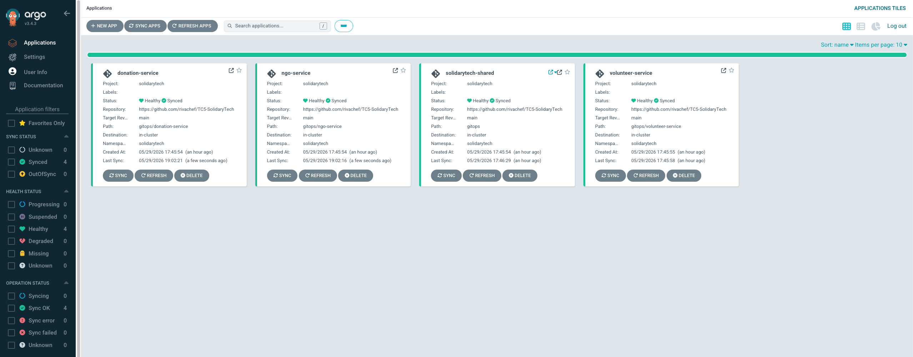

> Prova de que `solidarytech-shared`, `ngo-service`, `donation-service` e `volunteer-service` estão totalmente sincronizados com o branch `main` do Git e em estado `Healthy` no cluster.

**Pods em execução no cluster:**
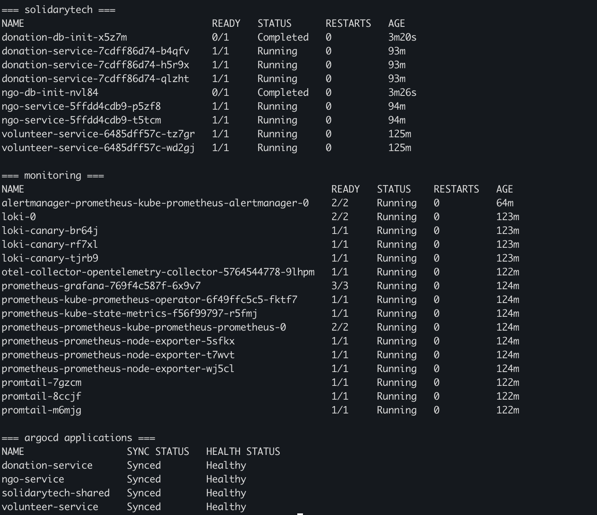

### 5.2 CI/CD com DevSecOps

**3 workflows CI verdes (lint + test + SAST + SCA + container scan + push ECR):**
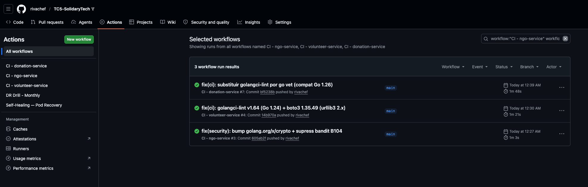

### 5.3 Observabilidade + APM

**Grafana — SolidaryTech Overview dashboard (parte 1):**
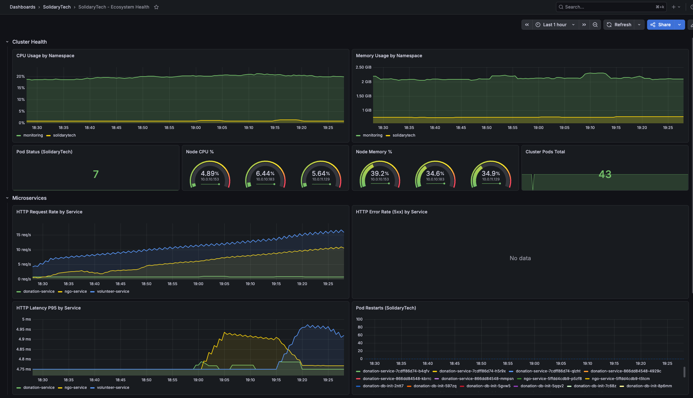

**Grafana — Golden Metrics + Logs em tempo real (parte 2):**
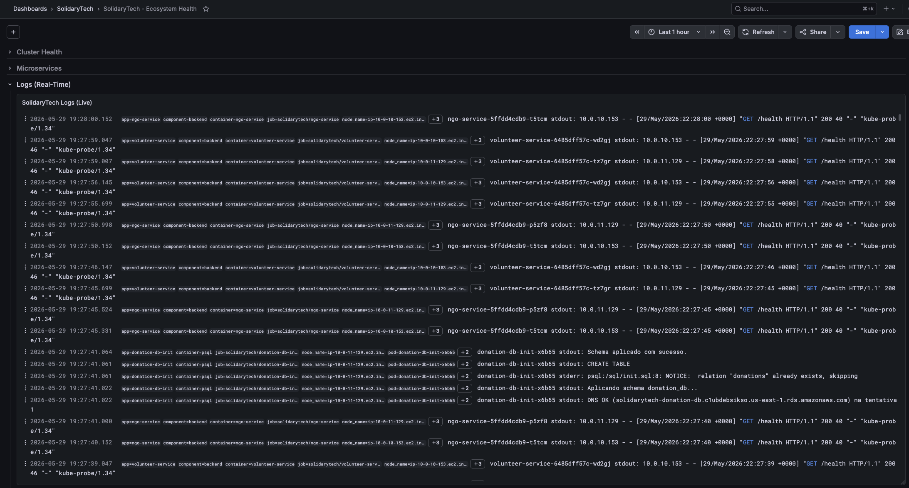

**New Relic APM — lista dos 3 microsserviços:**
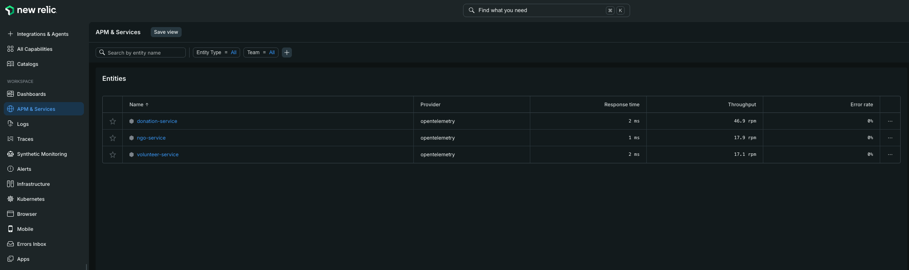

**New Relic — Summary do donation-service (Hot Path):**
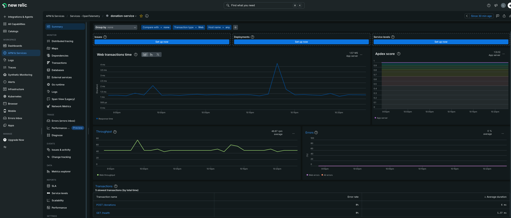

**New Relic — Distributed Trace waterfall:**
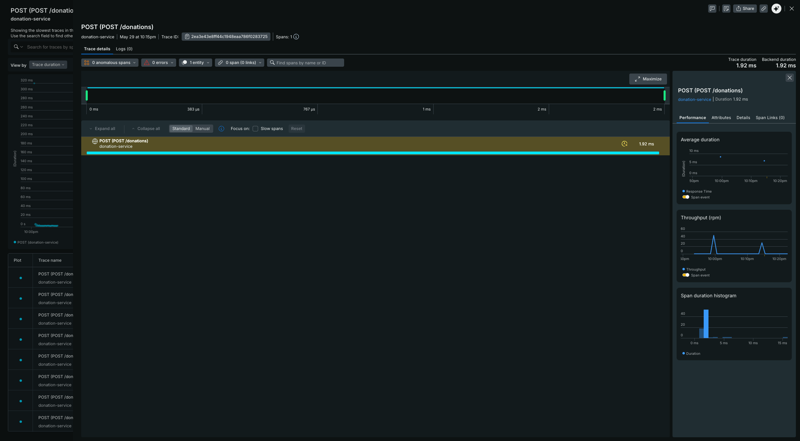

> Visualiza o caminho completo de uma requisição: HTTP → DB insert → SQS publish, com latência por span. Base para diagnóstico rápido de degradação.

### 5.4 ITSM — Gestão de Incidentes

**PagerDuty — 3 incidents triggered via Events API V2:**
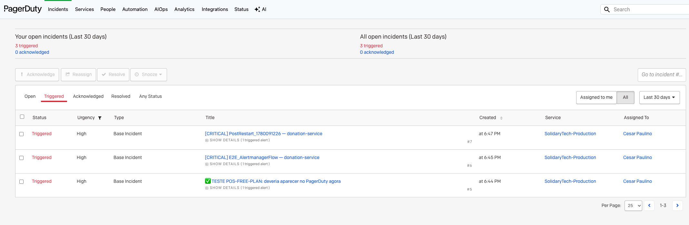

> Service `SolidaryTech-Production` com 3 incidents triggered pelo Alertmanager + curl manual de teste. Activity feed mostra "Triggered through the API".

**Discord — canal com alertas Alertmanager + notificações self-healing:**
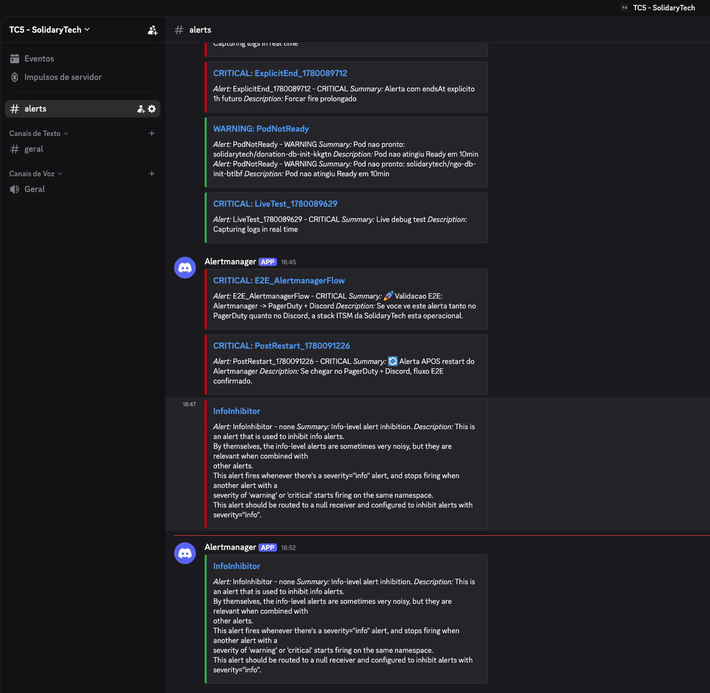

### 5.5 Self-Healing — redução de MTTR

**GitHub Actions — workflow self-healing executando rollout restart:**
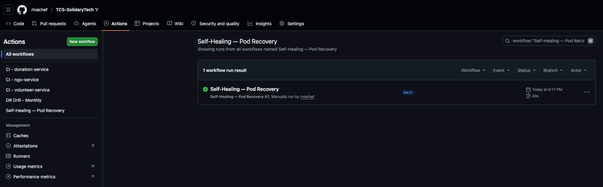

> Run #26662680566 — 43 segundos para concluir rollout restart de 3 pods do `donation-service` com notificações Discord automáticas.

### 5.6 Disaster Recovery

**Velero — backup completo cross-region (us-east-1 → us-west-2):**


**DynamoDB Global Tables — replica us-west-2 ACTIVE:**


### 5.7 FinOps — Tags em ação

**AWS Tag Editor — 22 recursos com tag `Project = SolidaryTech`:**
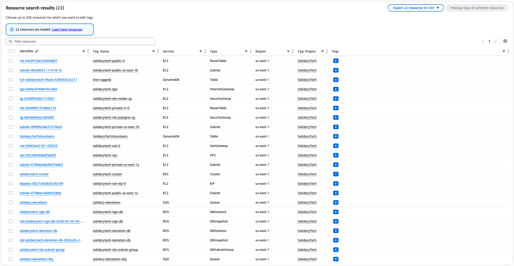

> Cobertura: EC2 (subnets, VPC, IGW, NAT, SGs, route tables, EIP), DynamoDB (volunteers + tflock), EKS (cluster + node group), RDS (2 DBs + 2 snapshots + subnet group), SQS (main + DLQ). Inclui snapshots automáticos do RDS atestando `copy_tags_to_snapshot = true`.

---

## 6. Recursos / Links

| Recurso | Link |
|---------|------|
| Repositório principal | https://github.com/rivachef/TC5-SolidaryTech |
| Upstream original | https://github.com/dougls/hackathon-DCLT |
| Vídeo de demonstração | _(adicionar)_ |
| ArgoCD UI | _(LoadBalancer URL — dinâmica)_ |
| Grafana | _(LoadBalancer URL)_ |
| New Relic dashboard | https://one.newrelic.com |

---

## 7. Stack de tecnologias

| Categoria | Tecnologias |
|-----------|-------------|
| Cloud | AWS (EKS, RDS PostgreSQL, DynamoDB Global Tables, SQS, ECR, S3, NAT, EBS) |
| Container | Docker, distroless (Go), python:3.12-slim |
| Orchestration | Kubernetes 1.34, ArgoCD |
| IaC | Terraform 1.5+ (modular, multi-environment) |
| CI/CD | GitHub Actions com Trivy + gosec + bandit + flake8 + golangci-lint |
| Observability | Prometheus, Grafana, Loki, Promtail, OpenTelemetry Collector |
| APM | New Relic (OTLP) |
| ITSM | PagerDuty (Free), Discord webhook, GitHub Actions (self-healing) |
| AIOps | New Relic Applied Intelligence |
| DR | Velero (Opção A), Terraform Warm Standby (Opção B), DynamoDB Global Tables |
| Linguagens | Go 1.26 (Hot Path), Python 3.12 (ngo + volunteer) |

---

## 8. Métricas do projeto

- **Sprints concluídas:** 7 (1 → 5 + 5.5 + 6)
- **Commits no repositório:** 25+ commits incrementais com mensagens detalhadas
- **Bugs descobertos e corrigidos** (com causa raiz documentada): 20+
- **Linhas de código adicionadas:** ~3.500 (Terraform + YAML + scripts + Go/Python)
- **Documentos técnicos:** 5 (PCN, DR-STRATEGY, ITSM-LIFECYCLE, SRE-SLO, FINOPS-REPORT) + este

---

## Apêndices

- [PCN.md](PCN.md) — Plano de Continuidade de Negócios (executivo)
- [DR-STRATEGY.md](DR-STRATEGY.md) — Estratégia técnica de DR
- [SRE-SLO.md](SRE-SLO.md) — SLI/SLO/SLA formal
- [FINOPS-REPORT.md](FINOPS-REPORT.md) — Forecast + tags + recomendações
- [ITSM-LIFECYCLE.md](ITSM-LIFECYCLE.md) — Ciclo de vida de incidente
- [VIDEO-ROTEIRO.md](VIDEO-ROTEIRO.md) — Roteiro do vídeo de demonstração
